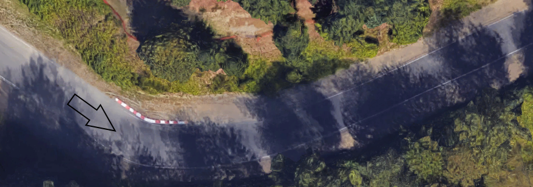
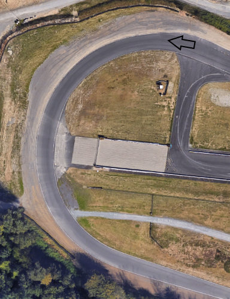

# Slow in. Fast out.

I once spent a couple of years learning how to drive a car around a race track. A friend lent me a great book [Speed Secrets: Professional Race Driving Techniques](https://www.amazon.com/Speed-Secrets-Professional-Driving-Techniques/dp/0760305188) by Ross Bentley. In particular, the section on how to dealing with different kinds of corners helped me improve my driving the most. 

At work, I was trying to plan a large software project. I noticed the cornering techniques in the book were analogous to software development planning. 

> Racing and software development have a similar goal - go as fast as possible without crashing.

Going fast on the track is about the tradeoffs made due to physics constraints.  Braking, power, traction and environmental conditions all come into play.  It is similar for software.  Problem complexity, technology, team size, communication tools, organization, and working styles all affect the tradeoffs made.

> Slow in. Fast out. is a common racing mantra. Figuring out how slow and how fast is the challenge.

## Corner Types
There are all kinds of corners on the track of software development. How to approach the corner, how to steer through the corner, and how to exit affect overall velocity.  Developing skills to recognize the upcoming corner and to adapt to the conditions in the corner drastically increase the chance of success.

### Decreasing Radius
Decreasing radius corners cause the most spectacular failures when a driver gets it wrong.  Over-cooking a corner and braking too late will cause the car to under-steer. The driver turns the wheel, but the car keeps going straight. This is because the traction limit has been exceeded by trying to slow down and change direction at the same time.  

Decreasing radius software tasks appear simple at the start and get harder over time.  As the developers work on the problem the discover difficult boundary cases, technology bugs, and system incompatibilities. Customers change requirements or management pulls in a deadline. 

Successfully driving a decreasing radius corner requires significant braking early.  Likewise, teams need to spend time upfront designing and experimenting to choose the right approach and discover problems early.  

It also requires patience to not accelerate too early on the exit.  Teams might need to step back and reconsider the design when they encounter a new challenge rather than taking engineering shortcuts.

*A decreasing radius corner - Turn 3A at Pacific Raceways*

### Increasing Radius##
An increasing radius corner has a tight curve at the beginning then straightens out. There is still braking required at the corner's entry, but once you make it past the apex, you can put the pedal down. Whee!

Increasing radius software tasks have straight-forward hurdles to overcome early on.  It can be bootstrapping a technology, getting the right interfaces figured out, or writing a function that is the heart of the solution.  After that, it is simple code, test, and deploy. Teams can often obtain a high degree of parallel development as the project progresses.

These corners still require patience.  If a driver hits the gas faster than the corner opens up, the car can over-steer. The tail of the car pushes out, over-rotates, and may spin out.

*An increasing radius corner - Turn 5A at Pacific Raceways*

### Constant Radius##
A constant radius corner has the same curvature all the way through.  It looks like a big letter U.  To drive this successfully, the driver brakes to the maximum speed for the corner and maintains that speed (even throttle) throughout the corner.  Only when the corner is almost done, can the gas be applied as the car moves from the inside to the outside of the track.

Constant radius software tasks are a grind. Teams have to maintain a balance between design, re-design, refactoring, and implementation.  Challenges crop up throughout the project, but are solvable with due diligence.  It takes a steady hand to hold the wheel in the same position throughout the corner.

*A constant radius corner - Turn 2 at Pacific Raceways*

## Compromised Corners
Great drivers don't drive each corner in isolation. They understand the entire track and take all the corners into account. 

When a corner leads onto a long straight, the driver wants to optimize the exit speed. The driver may brake earlier or change when they turn in.  When a corner comes after a long straight, the driver might brake as late as possible or even do some braking through the corner (called trail braking) to maximize the straightaway speed.  

On the software side of the analogy, figuring out which corners to compromise is tough. Tasks often depend upon other tasks.  How fast a team can complete an dependency task may unblock other tasks.  Making sure a dependency task is done right will prevent rework of the future tasks. Adding more people to a task can speed it up or might slow it down.  

Software teams don't get the benefit of learning track by taking practice laps; developers tend to work on new areas with new technology and are expected to deliver shippable code at the same time.  Teams have to be adapt to the corner they are in while looking ahead to the corners coming up. 

## Late Apex
Each corner has an apex, the geometric midpoint of the corner.  The track is wider than the car so drivers have leeway deciding where the car apexes (i.e. meet the inside of the track).  This could be before, at, or after the geometric apex.  

If the driver apexes early there will be more steering required to exit the corner.  This is generally bad because the driver wants to accelerate during the exit and traction is being used by by turning.

If the driver apexes late, then car is done turning and pointed straight down the track.  This allows for maximum acceleration on exit.  It is also the safest way to drive through the corner because the turning of the car is done after braking to the right speed for the corner. 

Software teams that late apex aren't surprised - they have designed and planned for maximum implementation, verification, and deployment velocity.

## 10/10ths
If a car is driving 10/10ths then it is at it absolute limit of traction. As tires approach their traction limit, they start emitting a chirping sound as they micro-slip and recover traction.  Great drivers use the feeling of the steering wheel and listen to the car to go through a corner. They also think about the condition of the car and the track.  Are the brakes hot and spongy? Are the tires warm or cold? If the car loses traction, is there room to recover?  What is the track temperature? 

Software teams will fail if driven beyond their limits.  Good planning continuously considers the team's condition, the state of the code, the customer's feedback on features, etc.  Software developers chirp discontent, usually through thinly veiled sarcasm.   

## Suspension
A cars suspension is critical to speed. Softer suspensions keep tires in contact with the road over rough surfaces.  Stiff suspensions allow for harder cornering and acceleration without body roll.  Great drivers understand how to set and drive to their suspension characteristics. They understand how braking shifts weight forward, acceleration shifts weight to the rear, and turning shifts weight to one side of the car.  They know that transitioning the suspension load too quickly will unbalance the car and reduce performance.

Software teams have suspension too.  Changing team direction or causing a context switch mid-task for a developer causes dips in productivity.  Too much change will unbalance a team.  Developers thrive on accomplishing atomic tasks, so sometimes it is best to let them focus on one thing and finish it before moving to the next task.  Agile methodologies like Scrum prevent changes mid-sprint to stop chaotic change.

## Thoughtful Driving
Learning how to think about my driving and discovering new techniques improved my driving both on and off the track.  It is an ongoing process of practice, performance, and review.  Why did I get that corner wrong?  Why did my instructor gasp and white-knuckle the door handle when I passed that car? How do the tires feel when you end up drifting a bit in long corner? Why did that Z4 spin out on that same corner 3 times?

> The practice of software development requires practice.

Thoughtful dev teams continuously strive to improve. They take time to estimate, record their efforts, and compare against actual effort. Their retrospectives aren't just cathartic venting; they implement improvements. They consider how much upfront design is required, what they need to learn in advance, and when a proof-of-concept is warranted.  These teams go faster, produce better code, and win customers.
